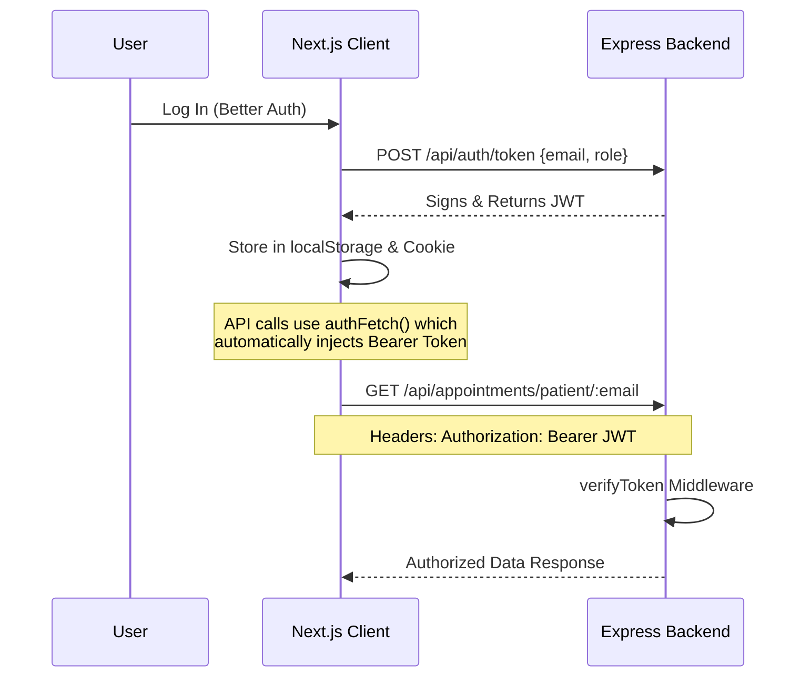

<div align="center">


# 🏥 AuraNex — Healthcare Appointment Platform

**A modern, full-stack Hospital Appointment & Healthcare Management System**  
built with Next.js 16, Better Auth, Stripe, and an Express/MongoDB backend.

[🌐 Live Demo](https://auranex-client.vercel.app) · [🗄️ Backend Repo](https://github.com/saikot05/auranex-server) · [💻 Frontend Repo](https://github.com/saikot05/auranex-client)

</div>

---

## 🔗 Live Links

| Resource | URL |
|---|---|
| 🌐 Live Frontend | [https://auranex-client.vercel.app](https://auranex-client.vercel.app) |
| 🚀 Live Backend API | [https://auranex-server.vercel.app](https://auranex-server.vercel.app) |
| 💻 Frontend Repository | [https://github.com/saikot05/auranex-client](https://github.com/saikot05/auranex-client) |
| 🗄️ Backend Repository | [https://github.com/saikot05/auranex-server](https://github.com/saikot05/auranex-server) |

---

## 🛠️ Technology Stack

| Layer | Technology |
|---|---|
| **Core Framework** | Next.js 16 (App Router, Turbopack) |
| **Styling** | TailwindCSS, DaisyUI, Vanilla CSS |
| **UI Components** | HeroUI, Gravity UI Icons |
| **Authentication** | Better Auth (Email + Google OAuth) |
| **Payments** | Stripe Checkout |
| **Database** | MongoDB (via Express backend) |
| **Security** | JWT — Bearer token verification on all protected routes |

---

## ✨ Core Features

### 🔍 Doctor Search & Discovery
Interactive search and filtering by name or medical specialty. Card and table layout toggle with pagination.

### 💳 Stripe Booking Checkout
End-to-end Stripe Checkout flow — handles booking dates, time slots, patient metadata, and post-payment appointment creation.

### 📊 Role-Based Dashboards

| Role | Capabilities |
|---|---|
| **Patient** | View appointments, payment logs, reviews; reschedule & cancel bookings |
| **Doctor** | Manage appointment statuses, set schedule slots, write & manage prescriptions, view performance analytics |
| **Admin** | Platform-wide analytics, user role & status management, doctor verification flow, global transaction logs |

### 🔐 Verified Security
All backend CRUD operations are protected with JWT Bearer token verification via a custom Express middleware.

---

## 🔐 JWT Route Protection Flow



---

## ⚙️ Local Setup

### 1. Clone the repositories

```bash
git clone https://github.com/saikot05/auranex-client.git
git clone https://github.com/saikot05/auranex-server.git
```

### 2. Install dependencies

```bash
cd auranex-client
npm install
```

### 3. Environment Configuration

Create a `.env` file in the root of `auranex-client`:

```env
NEXT_PUBLIC_BASE_URL=http://localhost:5000
BETTER_AUTH_URL=http://localhost:3000
NEXT_PUBLIC_BETTER_AUTH_URL=http://localhost:3000
BETTER_AUTH_SECRET=your_better_auth_secret

MONGO_DB_URI=your_mongodb_connection_uri
AUTH_DB_NAME=your_auth_db_name

GOOGLE_CLIENT_ID=your_google_client_id
GOOGLE_SECRET=your_google_client_secret

NEXT_PUBLIC_STRIPE_PUBLIC_KEY=your_stripe_public_key
STRIPE_SECRET_KEY=your_stripe_secret_key
```

### 4. Run the development server

```bash
npm run dev
```

Open [http://localhost:3000](http://localhost:3000) in your browser.

> ⚠️ Make sure the backend server (`auranex-server`) is also running on port `5000`.

---

## 📁 Project Structure

```
auranex-client/
├── app/
│   ├── (root)/              # Public pages (home, about, contact)
│   ├── auth/                # Sign in & Sign up pages
│   ├── dashboard/
│   │   ├── admin/           # Admin dashboard & analytics
│   │   ├── doctor/          # Doctor dashboard
│   │   └── patient/         # Patient dashboard
│   ├── find-doctors/        # Doctor listing & detail pages
│   └── api/                 # Next.js API routes (Stripe, Better Auth)
├── components/              # Shared UI components (Navbar, etc.)
├── lib/                     # Auth client, API helpers
└── proxy.js             # Route protection via Better Auth
```

---

<div align="center">
  Made with ❤️ by <a href="https://github.com/saikot05">saikot05</a>
</div>
