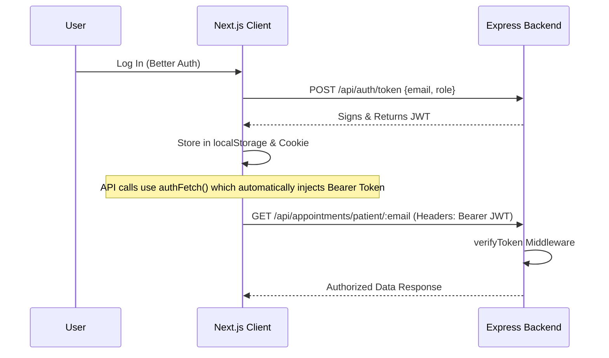

# AuraNex Client (MediCare Connect)

AuraNex (MediCare Connect) is a modern, responsive Hospital Appointment & Healthcare Management System built using Next.js, HeroUI, Gravity UI, and TailwindCSS. It integrates seamlessly with Better Auth for identity management, Stripe for secure payment flows, and an Express/MongoDB backend with JWT-based route verification.

## 🛠️ Technology Stack
- **Core Framework**: Next.js 16 (App Router, Turbopack)
- **Styling**: Vanilla CSS, TailwindCSS, DaisyUI
- **UI Components**: HeroUI, Gravity UI Icons
- **Authentication**: Better Auth
- **Payments**: Stripe Checkout Integration
- **Security**: Client-side JWT utility with dual `localStorage` & Cookie caching for seamless client fetches and next/headers Server Actions forwarding.

## ✨ Core Features
1. **Doctor Consultations Search**: Interactive search and filtering by specialty or name.
2. **Stripe Booking Checkout**: Fully integrated Stripe checkout flow that handles booking dates, time slots, patient details, and metadata propagation.
3. **Dynamic Dashboards**:
   - **Patient Dashboard**: Dynamic counters showing total appointments, upcoming consults, payment logs, and reviews, complete with rescheduling and cancellation capabilities.
   - **Doctor Dashboard**: Manage appointment request statuses (pending, accepted, canceled), set schedule slots, write/manage prescriptions, and review performance analytics.
   - **Admin Dashboard**: Comprehensive platform-wide analytics, user role/status management, doctor verification flow, and global transaction logging.
4. **Verified Security**: End-to-end JWT token verification for all backend CRUD operations.

## ⚙️ Local Setup

1. **Clone the repository**
2. **Install dependencies**:
   ```bash
   npm install
   ```
3. **Environment Configuration**: Create a `.env` file in the root of `auranex-client`:
   ```env
   NEXT_PUBLIC_BASE_URL=http://localhost:5000
   BETTER_AUTH_URL=http://localhost:3000
   STRIPE_PUBLIC_KEY=your_stripe_public_key
   ```
4. **Run the Development Server**:
   ```bash
   npm run dev
   ```

## 🔐 JWT Route Protection Flow

